---
html:
  embed_local_images: true
  embed_svg: true
  offline: true
  toc: true
export_on_save:
  html: true
---

# BLE Capture Environment

本書ではBLEパケットをキャプチャするためのドングル・そのキャプチャ方法に関して扱う。

## ドングル本体について

### 現在利用中のドングル

現在はTexas Instruments(TI (テキサス・インスツルメンツ))社の
[USBドングル](https://www.ti.com/tool/ja-jp/CC2540EMK-USB)
を利用している。

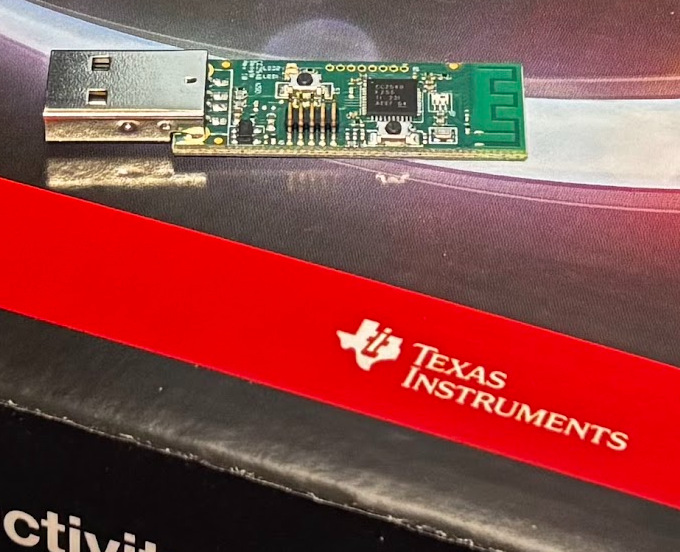

このドングルは専用のツールを利用するため、直観的に利用しやすいのがメリットである。

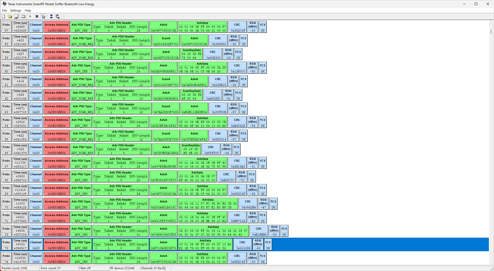

その反面、以下のようなデメリットが存在する。

- 専用ツール以外でキャプチャできない
- キャプチャ中にツールが落ちることがある
- キャプチャ中にログ表示が止まることがある
- (環境依存が高いかもしれないが、)パケットが著しく欠損することがある

従って、代替となるドングルを検討・用意する。

### 代替利用するドングル

nordicのnRF52840を搭載したドングル`seeed XIAO-nrf52840`を利用する。  
技適も通っているので、安心して利用できる。  

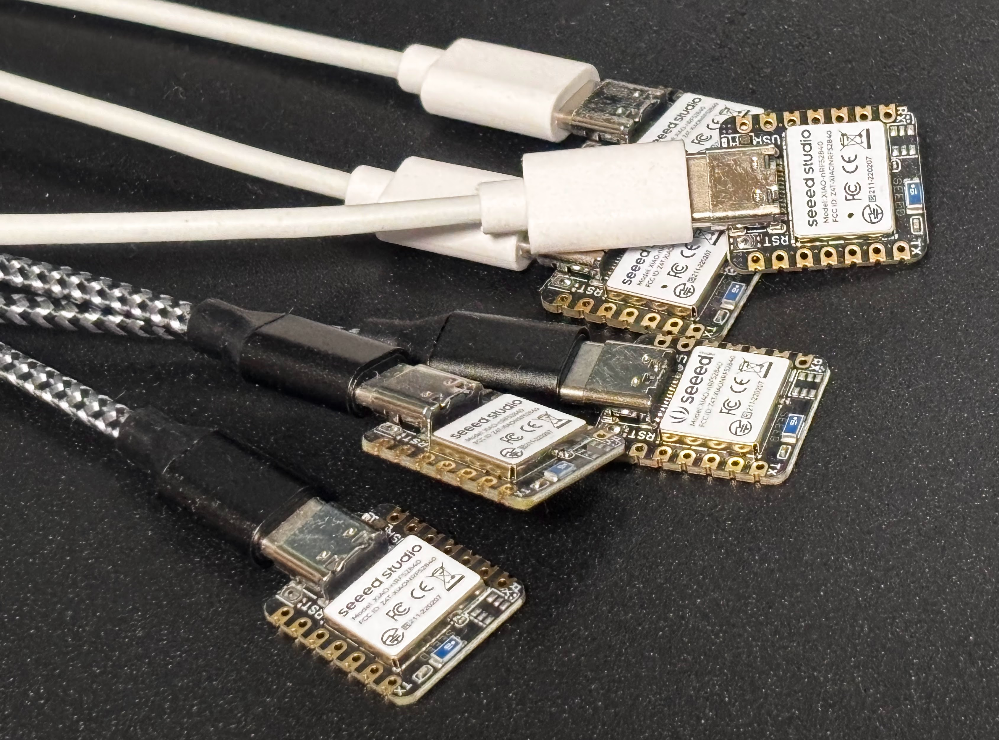

## nRF52840のFW書き換え

2025年7月頃までのネット記事で見かける手順は利用できなくっている(リンク先にアクセスできなくなっている)ので、改めて各種ドキュメントから探した手順をとる。  

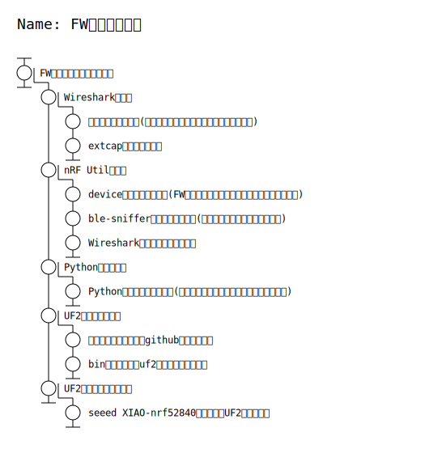

### Wiresharkの用意

BLE通信パケットを表示するのにWiresharkを利用する。  
あとの手順を単純化するため、先に最低限の準備をしておく。  

#### extcapフォルダの用意

extcapフォルダはデフォルトで作成されないので、今までに作成したことがないならこの手順は必須。  
作成したことがあるかないか分からない場合、一読しておいて欲しい。  

:::caution
そもそもWireshark本体をインストールしていないなら、先にWireshark本体をインストールしておくこと。  
インストール時の画面キャプチャを後述しておくので、必要あれば参考にすること。  
:::

extcapフォルダはwiresharkのGUI経由で作成できる。  

1. wiresharkを起動  
1. ツールバーから[help]-[wiresharkについて]をクリック  
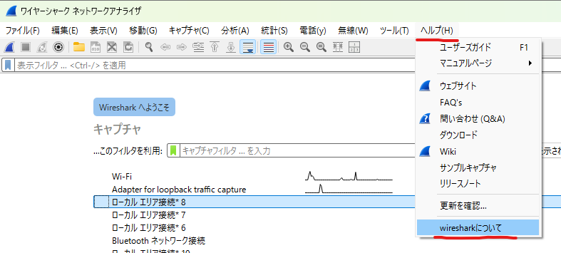
1. `wiresharkについて`というウィンドウが表示されるので、ウィンドウ内で`フォルダ`タブをクリック
1. `個人Extcapパス`に記載されている青文字のパスをダブルクリック  
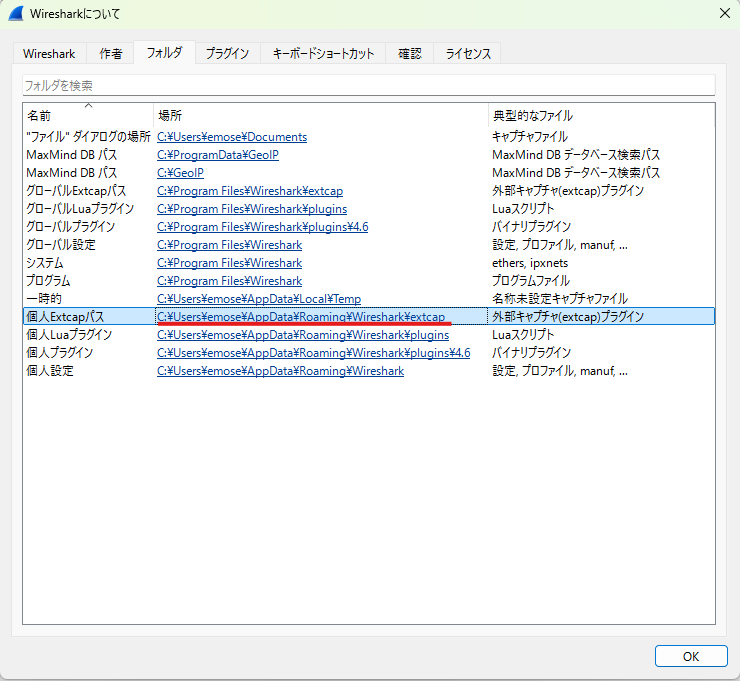
1. フォルダが存在しなければ、作成するか聞かれるので`はい`を選択してフォルダを作成する。  
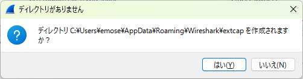
1. 新しいファイルエクスプローラーが開いて、該当パスのフォルダが表示される。  
  本手順で初めてフォルダ作成したのなら空フォルダが表示されることになる。  
  過去に同フォルダを作成したことがあったなら、その頃のファイル群が格納されたフォルダが表示されることになる。  

#### Wiresharkのインストール

[公式ページ](https://www.wireshark.org/download.html)より最新版(2025/11/16時点で4.6.0)をダウンロードする。  
参考程度にwiresharkをインストールした際の画面キャプチャを張り付けておく。  

:::note
単なるlog程度の情報なので、インストール済みの人やインストールに困らない人は読み飛ばして構わない。  
:::

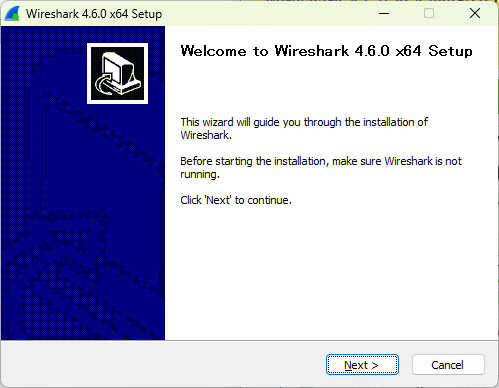  
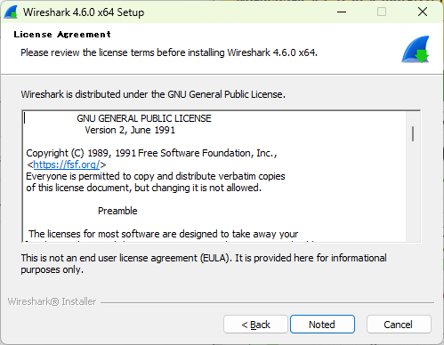  
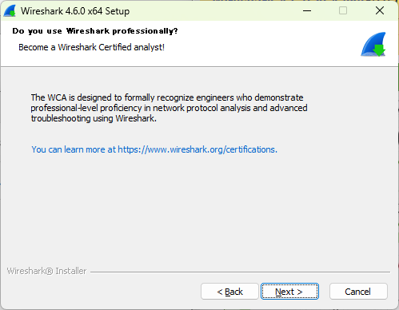  
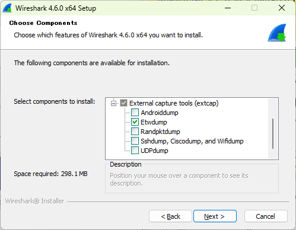  
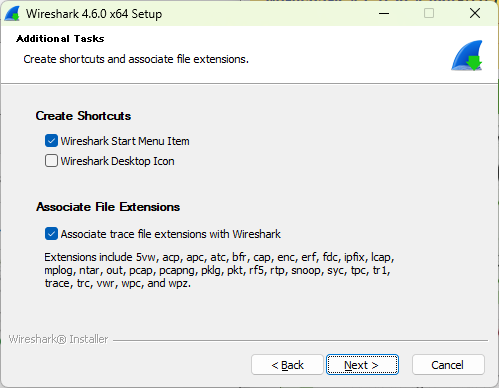  
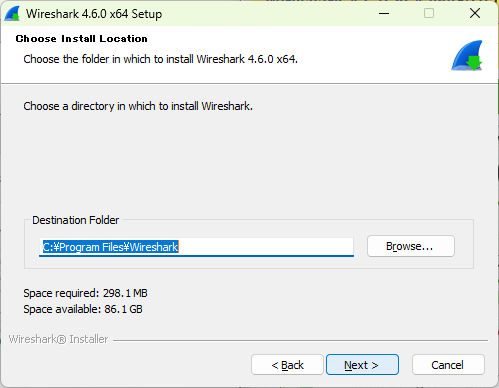  
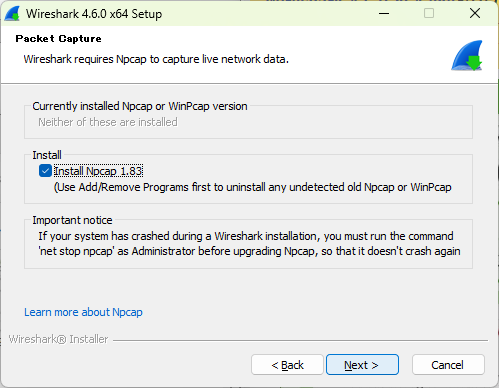  
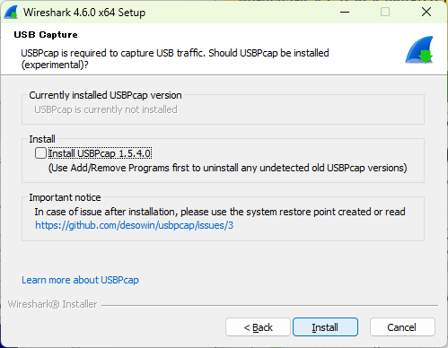  

途中でnpcapのインストールが挟まる

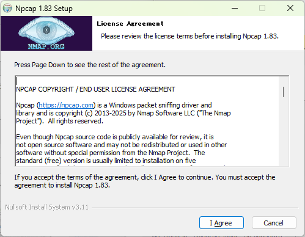  
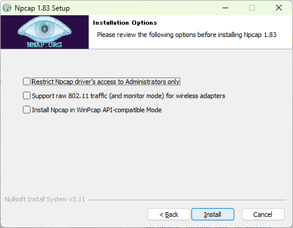  
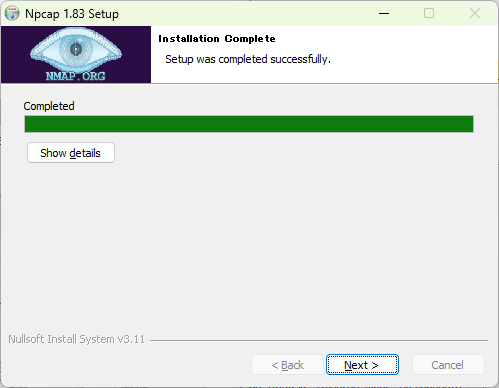  

npcapのインストールが完了したらwiresharkのインストールに戻る

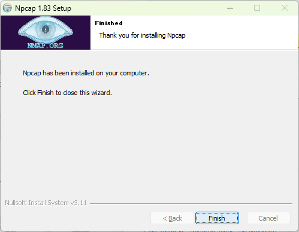  
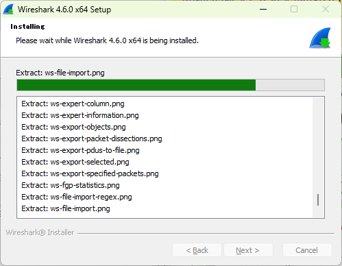  
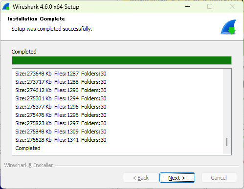  
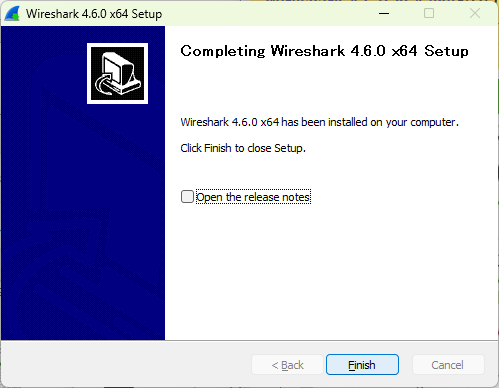  

### nRF Utilの準備

FWの書き換えやパケットキャプチャに必要となるツールの準備を行う。  

#### 本体の準備

1. まず以下ページから`nRF Util`というツールのexeを入手する。  
  [https://www.nordicsemi.com/Products/Development-tools/nRF-Util/Download?lang=en#infotabs](https://www.nordicsemi.com/Products/Development-tools/nRF-Util/Download?lang=en#infotabs)
1. exeファイルを適当なフォルダへ配置してパスを通す。  

        例: "C:\tools\nordic\nrfutil.exe"  

#### deviceモジュールの用意

デバイスのシリアルナンバーやCOMポートを確認するためのモジュールを追加する。  
正常なFWでなければリストに表示されないようなので、FWの書き換え成否を確認することができる。  

1. [Programming the nRF Sniffer firmware](https://docs.nordicsemi.com/bundle/nrfutil/page/nrfutil-ble-sniffer/guides/programming_firmware.html#programming-sniffer-firmware-using-nrfutil-device)で紹介されている以下コマンドを利用する。  

        nrfutil install device

1. 以下コマンドでデバイスリストを確認できる。

        nrfutil device list

1. 成功していれば以下のように表示される。  
※ シリアルナンバーは`1234567890123456`に置き換えているが、実際には個体に応じた値が出力される。  

        PS C:\Users\kome> nrfutil device list
        WARNING: JLinkARM DLL not found. Devices that require J-Link will not be recognized correctly, and J-Link operations will not be available. Install SEGGER J-Link from https://www.segger.com/downloads/jlink/. Currently tested version: JLink_V8.66.

        1234567890123456
        Product         nRF Sniffer for Bluetooth LE
        Ports           COM5
        Traits          usb, serialPorts, nordicUsb

        Supported devices found: 1

        PS C:\Users\kome>

#### binファイルの用意

1. [Getting the sniffer firmware](https://docs.nordicsemi.com/bundle/nrfutil/page/nrfutil-ble-sniffer/nrfutil-ble-sniffer_0.16.0.html#getting-the-sniffer-firmware)で紹介されている以下コマンドを利用する。  

        nrfutil install ble-sniffer

1. すると以下パスへFWが配置される。  

        C:\Users\kome\.nrfutil\share\nrfutil-ble-sniffer

1. あとで利用するので以下圧縮ファイルを解凍しておく。  

        "C:\Users\kome\.nrfutil\share\nrfutil-ble-sniffer\firmware\sniffer_nrf52840dongle_nrf52840_4.1.1.zip"

#### Wireshark用の設定ファイル用意

1. [Using the sniffer with Wireshark](https://docs.nordicsemi.com/bundle/nrfutil/page/nrfutil-ble-sniffer/nrfutil-ble-sniffer_0.16.0.html#using-the-sniffer-with-wireshark)で紹介されている以下コマンドを利用する。  

        nrfutil ble-sniffer bootstrap

1. 以下のような出力を得られる。  

        C:\Users\kome>nrfutil ble-sniffer bootstrap
        Bootstrapping ble-sniffer...
        Bootstrap succeeded
        Next step
        ---------

        Program a device with the appropriate sniffer firmware. We recommend using `nrfutil-device` for this.

        Find the device you would like to program with the following command:

                nrfutil device list

        Then, you can program this device with the sniffer firmware with the following command:

                nrfutil device program --firmware <fw> --serial-number <serial-number>

        Supported devices
        -----------------
        * nRF52840 Dongle (firmware = C:\Users\kome\.nrfutil\share\nrfutil-ble-sniffer\firmware\sniffer_nrf52840dongle_nrf52840_4.1.1.zip)
        * nRF52840 DK (firmware = C:\Users\kome\.nrfutil\share\nrfutil-ble-sniffer\firmware\sniffer_nrf52840dk_nrf52840_4.1.1.hex)
        * nRF52833 DK (firmware = C:\Users\kome\.nrfutil\share\nrfutil-ble-sniffer\firmware\sniffer_nrf52833dk_nrf52833_4.1.1.hex)
        * nRF52 DK (firmware = C:\Users\kome\.nrfutil\share\nrfutil-ble-sniffer\firmware\sniffer_nrf52dk_nrf52832_4.1.1.hex)

        C:\Users\kome>

1. 以下ファイルがWiresharkの個人extcapフォルダに格納されていれば、成功である。  

      - wireshark-shim.exe
      - wireshark-hci-shim.exe
      - wireshark-shim-config.json

    extcapフォルダは前述した`extcapフォルダの用意`で作成・確認したフォルダパスである。  
    同確認手順を以下へ示しておく。  

      1. wiresharkを起動
      1. ツールバーから[help]-[wiresharkについて]をクリック
      1. `wiresharkについて`というウィンドウが表示されるので、ウィンドウ内で`フォルダ`タブをクリック
      1. 下から4行目の`個人extcapパス`に記載されているパスが今回探しているパスである。  
      ※ 何行目に表示されるかは個々人の環境によって差があると思われる。

              個人extcapパス  C:\Users\kome\AppData\Roaming\Wireshark\extcap  外部キャプチャ(extcap)プラグイン

### python環境の準備

### UF2ファイルの準備

USB経由でFW書き込みするにはUF2ファイルを利用する必要があるため、binファイルからuf2ファイルへ変換する。  

1. uf2の[githubページ](https://github.com/microsoft/uf2)からプロジェクト全体をクローンする。  

        例: "C:\tools\uf2-master\"

1. 端末(CMDやWindowsTerminalなど)からプロジェクトを開き、uf2conv.pyの配置されているフォルダをカレントディレクトリとしておく

        例: cd C:\tools\uf2-master\utils

1. binからuf2への変換を行う  
[Adafruit nRF52 Bootloader](https://github.com/adafruit/Adafruit_nRF52_Bootloader?tab=readme-ov-file#making-your-own-uf2)で紹介されている以下のコマンドを参考にする。  

        nRF52840
        uf2conv.py firmware.bin -c -b 0x26000 -f 0xADA52840

    今回の手順では以下コマンドを実行することになる。  

        python uf2conv.py "C:\Users\kome\.nrfutil\share\nrfutil-ble-sniffer\firmware\sniffer_nrf52840dongle_nrf52840_4.1.1\sniffer_nrf52840dongle_nrf52840_4.1.1.bin" -c -b 0x26000 -f 0xADA52840

1. 以下ファイルが出力されていれば成功

        例: cd C:\tools\uf2-master\utils\flash.uf2

### UF2ファイルの確認

以下コマンドを使って、ハッシュ値を確認しておく。

certutil -hashfile <ファイルパス> <ハッシュアルゴリズム>

以下利用できる。

- MD2
- MD4
- MD5
- SHA1
- SHA256
- SHA384
- SHA512

今回はMD5とSHA256を記録しておく。

MD5での実行結果を以下に示す。

        PS C:\Users\kome> certutil -hashfile "D:\flash.uf2" MD5
        MD5 ハッシュ (対象 D:\flash.uf2):
        d05835d8cd4ca31950e2a7d4becef079
        CertUtil: -hashfile コマンドは正常に完了しました。
        PS C:\Users\kome>

SHA256での実行結果を以下に示す。

        PS C:\Users\kome> certutil -hashfile "D:\flash.uf2" SHA256
        SHA256 ハッシュ (対象 D:\flash.uf2):
        bb8f0a497a298e1710c4a8fe3a3dca11f41dd74b3f1b8c8daef9e84f83c43277
        CertUtil: -hashfile コマンドは正常に完了しました。
        PS C:\Users\kome>

### binファイルの確認

変換元ファイルの確認結果も残しておく

        PS C:\Users\kome> certutil -hashfile "C:\Users\seigy\.nrfutil\share\nrfutil-ble-sniffer\firmware\sniffer_nrf52840dongle_nrf52840_4.1.1\sniffer_nrf52840dongle_nrf52840_4.1.1.bin" MD5
        MD5 ハッシュ (対象 C:\Users\seigy\.nrfutil\share\nrfutil-ble-sniffer\firmware\sniffer_nrf52840dongle_nrf52840_4.1.1\sniffer_nrf52840dongle_nrf52840_4.1.1.bin):
        ad071e0b850ddaa4299b397b53cb4927
        CertUtil: -hashfile コマンドは正常に完了しました。
        PS C:\Users\kome> 

        PS C:\Users\kome> certutil -hashfile "C:\Users\seigy\.nrfutil\share\nrfutil-ble-sniffer\firmware\sniffer_nrf52840dongle_nrf52840_4.1.1\sniffer_nrf52840dongle_nrf52840_4.1.1.bin" SHA256
        SHA256 ハッシュ (対象 C:\Users\seigy\.nrfutil\share\nrfutil-ble-sniffer\firmware\sniffer_nrf52840dongle_nrf52840_4.1.1\sniffer_nrf52840dongle_nrf52840_4.1.1.bin):
        51e557ba329232c66ca7420279cb16354b842d6ac2ea66ceb8f1b99f7a396905
        CertUtil: -hashfile コマンドは正常に完了しました。
        PS C:\Users\kome> 

### 作成したFWを書き込む

1. seeed XIAO-nrf52840をPCに接続する。  
1. RSTボタン(Type-Cコネクタの左側)を素早く2回押す。  
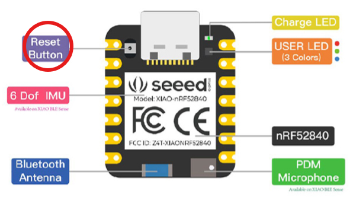
1. `XIAO-SENSE`というデバイス名でファイルエクスプローラーからアクセスできるようになる。  
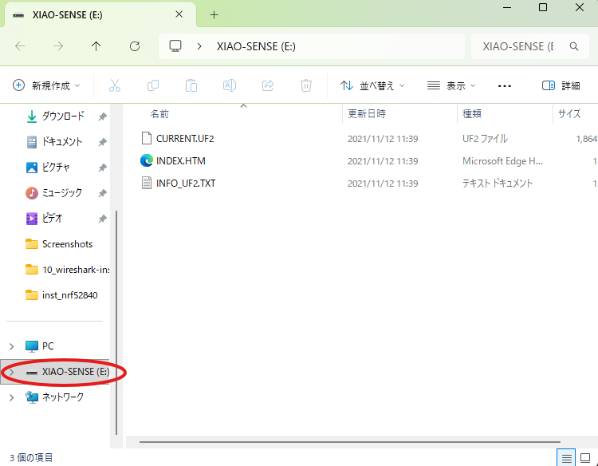
1. `XIAO-SENSE`を表示したウィンドウに、作成したuf2ファイルをドラッグアンドドロップする。  
uf2の書き込みに不慣れだと違和感を覚えるかもしれないが、ドラッグアンドドロップにより書き込みが行われ、問題なければウィンドウが自動で閉じる。  
書き込み先の3ファイルは特に気にしなくていい。  

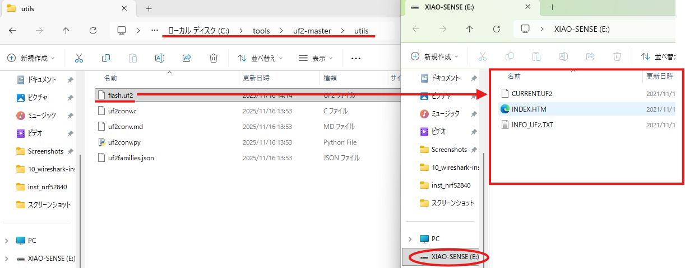

## Wiresharkでの解析

### 解析に必要なツールバーの表示

キャプチャする対象のアドバタイズパケットやGATT通信を行う対象を設定するのに必要なツールバーを表示する。  
先の手順で実行した`nrfutil ble-sniffer bootstrap`コマンドに成功していれば以下で表示できる。  

1. [表示]-[インターフェースツールバー]-[nRF Sniffer for Bluetooth LE]をクリックする。  
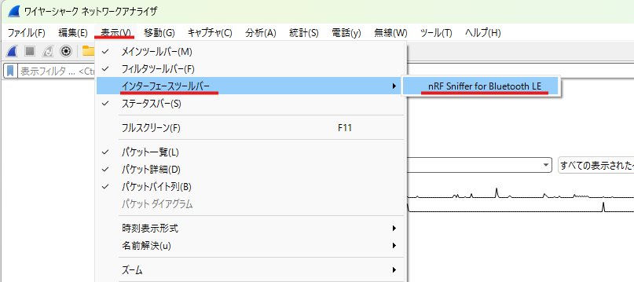
1. 下図のようにWiresharkのウィンドウへツールバーが表示される。  
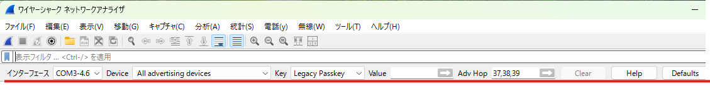

### 解析の開始

Wireshark起動時、パケットキャプチャするデバイスを選択する。  

:::note
本手順はキャプチャを一度停止してから再開する際にも必要になる。
:::

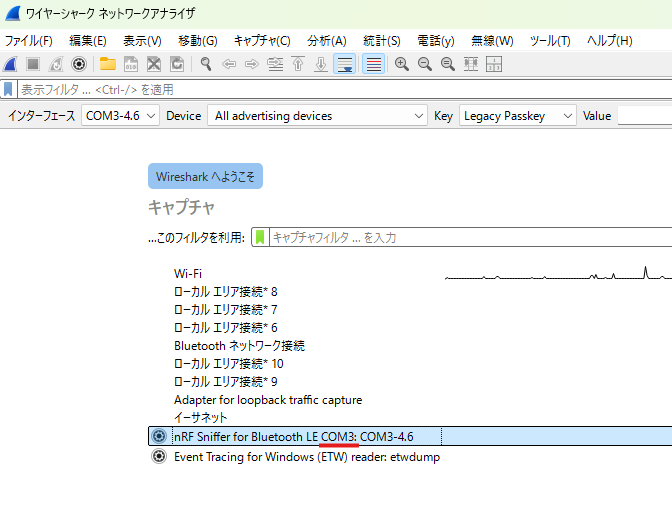

COMポートは先の手順で示した`nrfutil device list`で確認できる。

        PS C:\Users\kome> nrfutil device list

        1234567890123456
        Product         nRF Sniffer for Bluetooth LE
        Ports           COM3
        Traits          usb, serialPorts, nordicUsb

        Supported devices found: 1

        PS C:\Users\kome>

起動後、ツールバー上では以下のような選択を行う。  

1. キャプチャするCOMポートを選択する  
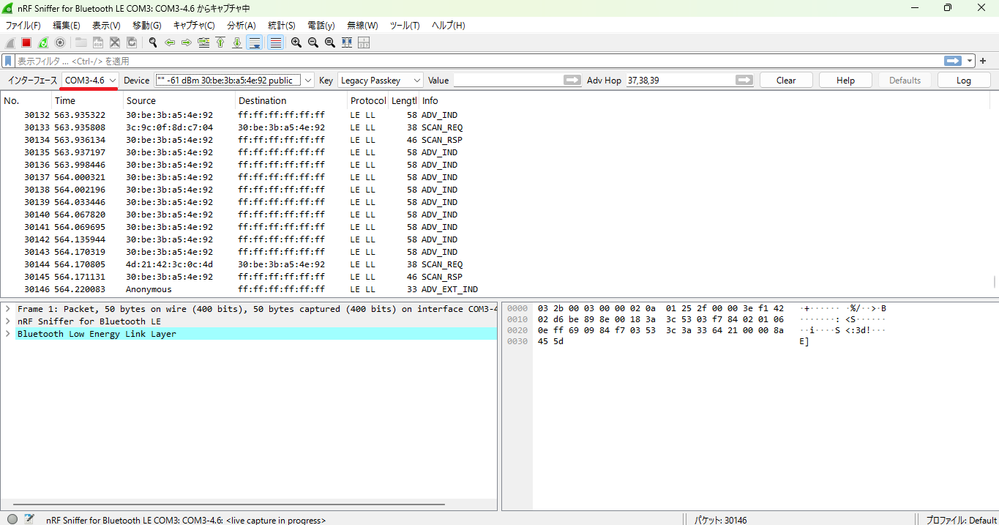
1. GATT通信を捕捉したいBDアドレスを選択する。  
ここで選択しておかないと、GAPから移行した後のGATT通信を見ることができない。
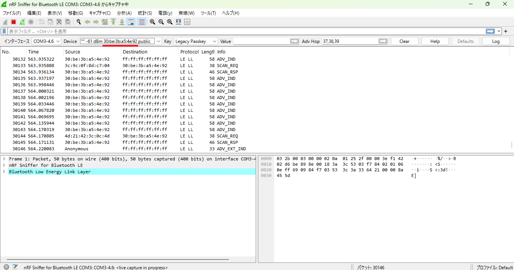
1. Advertisingパケットをキャプチャしたいチャネルを選択しておく。  
選択しなくてもキャプチャすること自体は可能である。
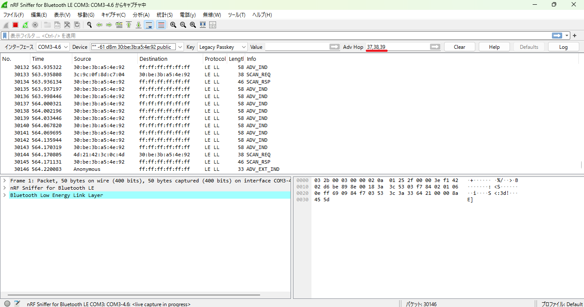

### 色分けルールの設定

パケットを区別しやすくするための色分け設定をしておく。

1. [表示]-[色付けルール]をクリック  
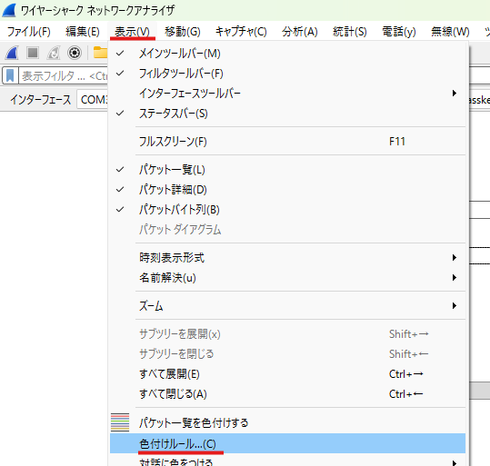
1. 用意してある[設定ファイル](環境ファイル/色分け)をインポートする  
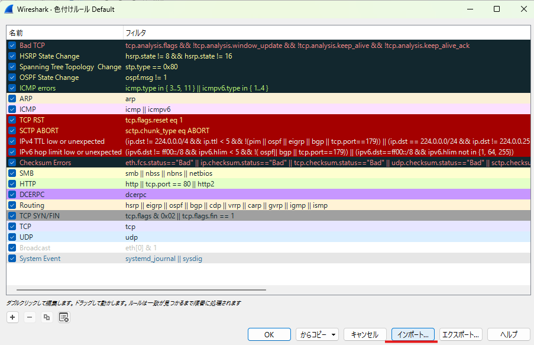
1. インポートに成功すれば一覧へ表示される。  
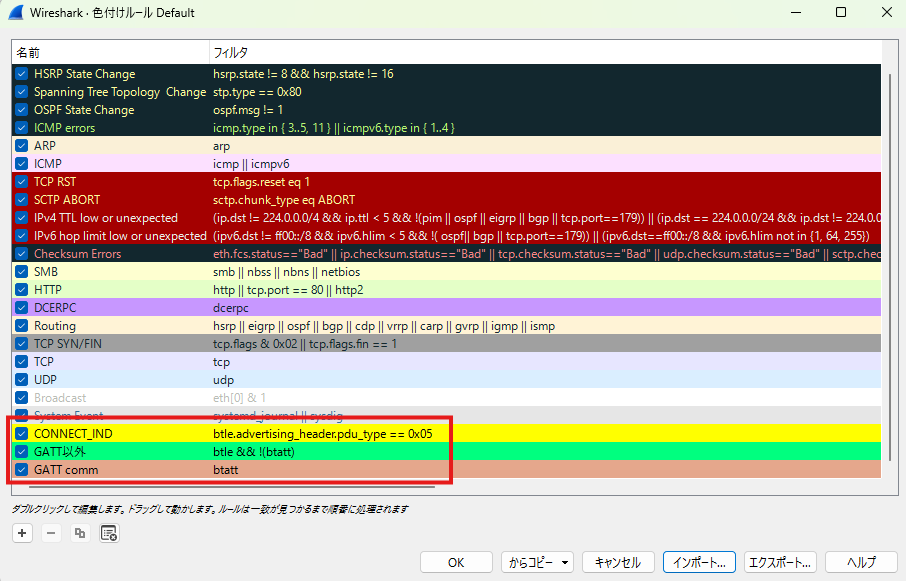

### 列表示の設定

必要な情報を列に表示して簡単に確認できるようにしておく。

1. タイトル行を右クリックして表示されるメニューより[列の設定]をクリック  

1. プラスボタンで行を追加して、カスタム式に任意の式を入力する。  

- btatt.handle  
- btatt.value  
- btatt.value[3]  
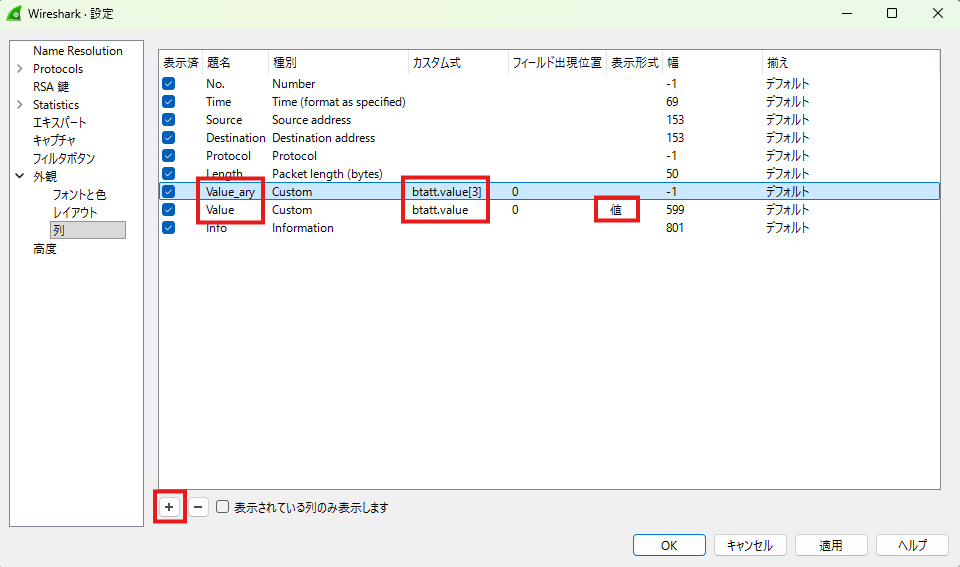

### プロファイルのインポート

これらの設定はプロファイルとしてエクスポートしたり、インポートしたりできる。

### フィルタの設定例

目的 | フィルタ | 補足
--- | --- | ---
チャネルでフィルタリングする | nordic_ble.channel | 例: 37
アドバタイズパケットをアドレスでフィルタリングする | btle.advertising_address | none
pdu_typeでフィルタリングする | btle.advertising_header.pdu_type | 例: 0x05: ADV_CONNECT_REQ
